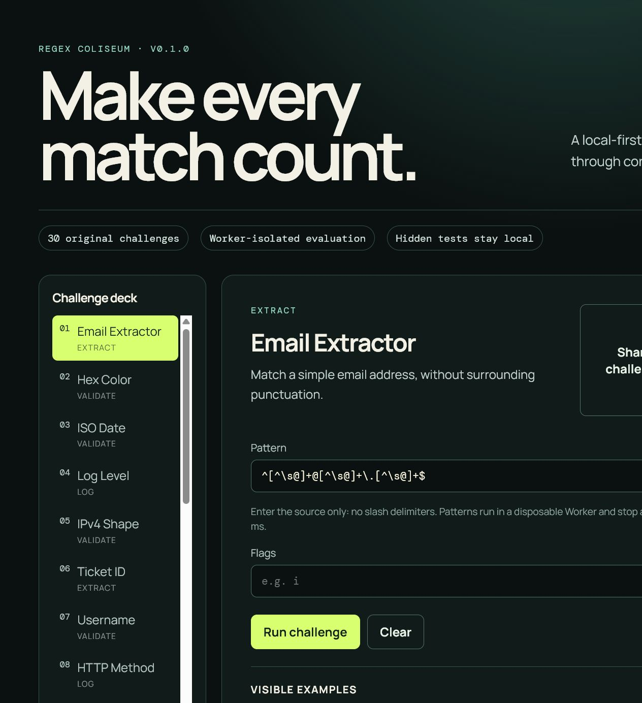

# Regex Coliseum

> Learn JavaScript regular expressions by competing on correctness, speed, and readability.

[](../../actions/workflows/ci.yml) [](LICENSE) [](../../releases/tag/v0.1.0)



Regex Coliseum is a local-first learning arena for students, developers, and interview practice. It evaluates your JavaScript regex against public, hidden, and performance inputs inside a disposable Web Worker.

- 30 original challenges across extraction, validation, logs, and refactoring
- Repeatable four-part score: correctness, runtime, pattern length, readability
- Shareable challenge-only URLs and a browser-local leaderboard—no account or network request

## Quick start

```bash
npm ci
npm run dev
```

Open the local URL Vite prints. Enter a regex source (without `/` delimiters), choose a challenge, then select **Run challenge**.

## Example

Input pattern: `^[^\s@]+@[^\s@]+\.[^\s@]+$`

For **Email Extractor**, the included offline fixture produces 5/5 visible, 2/2 hidden correct cases and a reproducible score. Run `npm run demo` to generate that output from the current source.

## Safety and privacy

Patterns execute in a dedicated Worker. If evaluation does not return within 250 ms, the worker is terminated and recreated. This is a containment boundary, not proof that every JavaScript regex is safe; do not treat it as a server-side ReDoS defense. Challenge data, scoring, and leaderboard entries are local. Share hashes encode only the challenge id, never a pattern or hidden fixture.

## Architecture

`src/core` contains deterministic domain logic. `src/workers` contains the unsafe execution adapter and its timeout controller. `src/adapters` contains browser-only storage. `src/features` is intentionally absent in this compact MVP: the one-screen application composes core and adapters in `src/App.tsx`.

See [the architecture guide](docs/ARCHITECTURE.md) and [privacy/security boundary](docs/PRIVACY_AND_SECURITY.md).

## Commands

```bash
npm run lint
npm run typecheck
npm run test:coverage
npm run test:e2e
npm run build
npm run package
make verify
make demo
make package
make release-check
```

`make demo` runs a real fixture. `make package` creates a versioned web archive and SHA-256 digest in `dist-release/`. `make release-check` intentionally requires a clean, committed worktree, release assets, changelog version, and no unfinished markers.

## Scope

This MVP teaches JavaScript-style regex behavior. It does not provide multi-user leaderboards, a server-side regex sandbox, PCRE compatibility, or a guarantee of semantic equivalence across every engine.

## Competitive position

Public-repository sampling is documented in [COMPETITOR_SCAN.md](docs/COMPETITOR_SCAN.md). The differentiation is a reproducible local challenge deck that makes accuracy, performance, and readability visible together, while keeping hidden examples off share links.

## Contributing

Read [CONTRIBUTING.md](CONTRIBUTING.md), follow the [Code of Conduct](CODE_OF_CONDUCT.md), and report security concerns through [SECURITY.md](SECURITY.md). The planned next increment is documented in [ROADMAP.md](docs/ROADMAP.md).

## License

MIT © the repository contributors.
